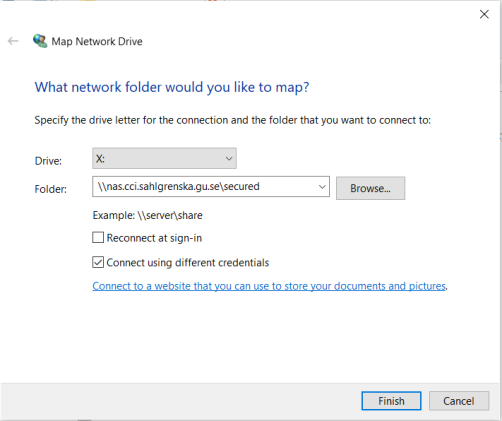
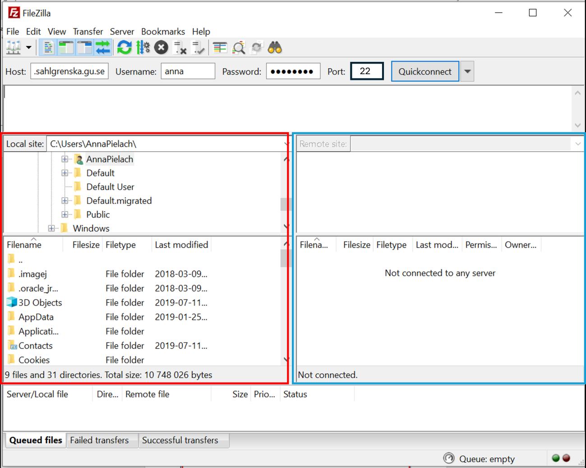
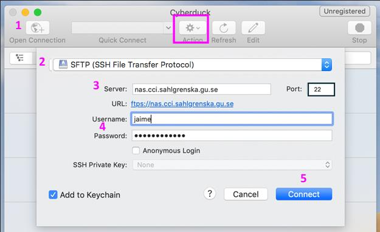
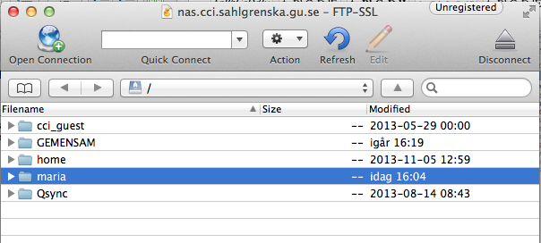
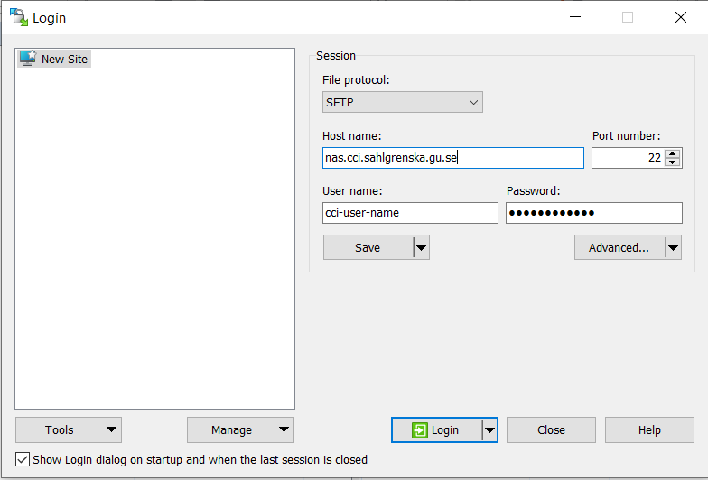
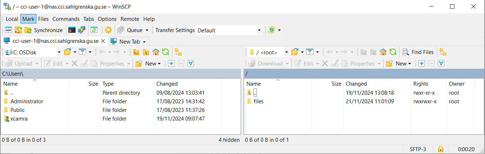

# How to connect to the CCI file server

## Contents

- [Rules](#rules)
- [Connecting from inside the CCI firewall](#connecting-from-inside-the-cci-firewall)
- [Connecting from outside the CCI firewall](#connecting-from-outside-the-cci-firewall)
    - [Filezilla](#filezilla)
    - [Cyberduck](#cyberduck)
    - [WinSCP](#winscp)

## Rules

1. At the end of your microscope session, log in to the transfer server and upload your data. As soon as you are back at your own computer, log in to the server and download your data to your computer. Remove the data from the server as soon as you have it on your own computer.
2. You are not allowed to upload anything, apart from images/data acquired at the CCI, to the CCI transfer server!
3. You are not allowed to use the CCI transfer server for storage!

## Connecting from inside the CCI firewall

1. Right click on *My computer* icon, then chose
*Map network drive*
2. In Folder, type:
*\\\nas.cci.sahlgrenska.gu.se\secured*
3. Be sure that *Reconnected at sign-in* is **not** selected
4. Chose to “connect using different credentials”
5. Press *Finish*
6. *Username*: serveridentity *Password*: ………
7. To Log out: Right click on *My computer*, then *disconnect network drive*

## Connecting from outside the CCI firewall

You need to have an FTP client that can connect via FTP-SSL to be able to connect to the CCI file server. We recommend the following sharewares:

- Mac and Windows: [FileZilla](https://filezilla-project.org/)
- Mac: [Cyberduck](https://cyberduck.io/)
- Windows: [WinSCP](https://winscp.net/eng/index.php)

> **Note:** There are problems to connect using the Wi-Fi network called *GoteborgsUniversitet*. Use either a wired network connection or the Wi-Fi network *Eduroam*.

### Filezilla

1. Download the [FileZilla](https://filezilla-project.org/) client PC version
2. Save the installation file locally on your computer and install the program.
3. Enter the following details:
4. In the remote site window you will see the folder you have access to. Select a destination folder in local site window (i.e. your computer), then drag from the right window to the left and the transfer will start.

Login settings:

- *host address*: nas.cci.sahlgrenska.gu.se
- *port*: 22
- *server identity and password*
- Click *Quickconnect*

### Cyberduck

Download the Mac version from [Cyberduck](https://cyberduck.io/). Save the installation file on your computer and install the program.

1. Open Cyberduck and choose *Open Connection*.
2. Choose the SFTP protocol.
3. Enter the server name: *nas.cci.sahlgrenska.gu.se*
4. Chose port 22
5. Type your server identity (one for each research group) and password.
6. Click the *Connect* button.

> **Note:** You might need to change the *Connect Mode* from *Default* to *Passive* under *More options*. If, like in the example below, the *More options* button is not displayed in the original window, try going to *Action* → *New Bookmark*. You will only see the remote folders. Navigate to files/user_folder. To download data either right-click on a file/folder or choose from the Action menu.

### WinSCP

Go to [WinSCP](https://winscp.net/eng/index.php) and download the WinSCP installation package to your computer. Double-click on the file WinSCP-version.number-Setup.exe and press Run to start the installation. Use the default installation options.

Login settings:

- *File protocol*: SFTP
- *Encryption*: TLS/SSL Explicit encryption
- *Host name*: nas.cci.sahlgrenska.gu.se
- *Port number*: 22
- *User name*: Your server identity (one for each research group)

> **Note:** The first time you log in you might get a question about whether you trust the certificate.

When logged in, you see your local folders on the left and the remote folders on the right and it is possible to drag and drop between these two panels. Navigate to the remote folder “files” and then find the folder for your username. Please note that you do not have access to the other folders.

Sincerely,  
The CCI Team

---
Medicinaregatan 7A, PO Box 435,  
SE 405 30 Gothenburg, Sweden  
[www.cf.gu.se](www.cf.gu.se)  
THE SAHLGRENSKA ACADEMY  
CENTRE FOR CELLULAR IMAGING
