# CrossLab manual – GU PI

The Centre for Cellular Imaging (CCI) is using a web-based tool, CrossLab, to help manage the equipment resources at the CCI. CrossLab is used for registration, all resource booking at CCI, tracking of usage, service requests, user database, inventory management and reporting/billing.  

## Contents

- [Signing up for CrossLab](#signing-up-for-crosslab)
- [Logging in CrossLab](#logging-in-to-crosslab)
- [Managing your profile settings](#managing-your-profile-settings)
- [Managing your group settings](#managing-your-group-settings)
    - [Members](#members)
    - [Entering/updating your billing information](#enteringupdating-your-billing-information)
    - [Invoices and the billing procedure](#invoices-and-the-billing-procedure)
- [Optional: CCI registration](#optional-cci-registration)

## Signing up for CrossLab

To use CrossLab, you need your own personal credentials; please follow the instructions below to sign up for a CrossLab account and create your Lab (research group) for billing. With active credentials you can access core services through this on-line system.

1. Navigate to the
[CCI core page](https://gothenburg.corefacilities.org/service_center/show_external/3429)

> **IMPORTANT**: Bookmark this page for future use.

2. Place your mouse pointer above the word Register at the top right corner and select:  
'Register using University of Gothenburg credentials'  
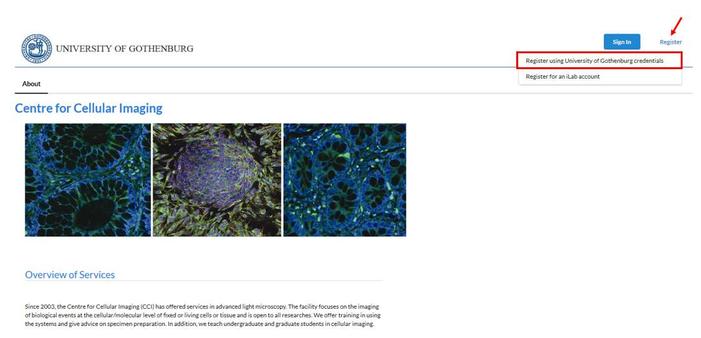
3. On the login page, select Sign in using SWAMID credentials  
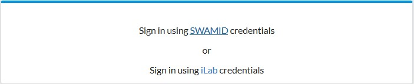
4. At this point you will be prompted to select an Identity service. Search for University of Gothenburg in the dropdown list (the easiest way is to start typing the word Gothenburg).
5. Select **log in** and provide your SWAMID (GU x-account) username and password  
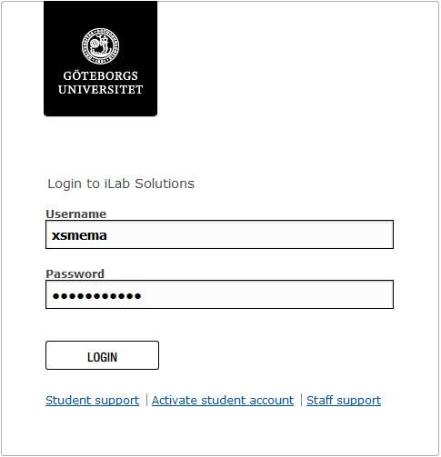
6. Once you have been authenticated you will be directed to a registration page:
    - First, select PI registration (GU) Lab from the drop-down list.
    - Your first name, last name, and email address will be pre-filled.
    - Add your telephone number.
    - Click Register

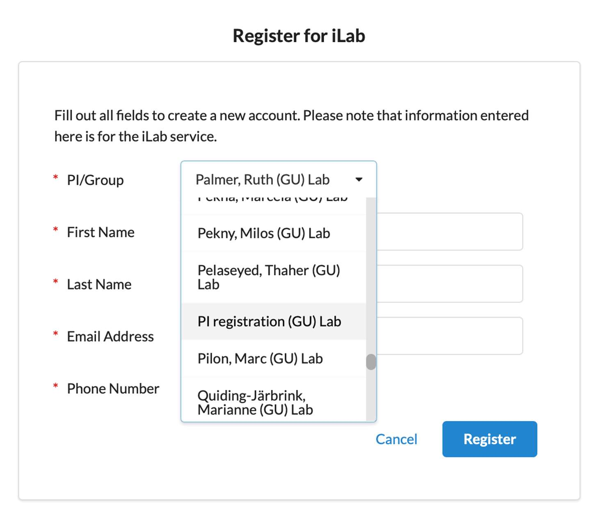
7. The next page you see will be a Greeting Page  
8. You will receive an email once your account has been approved.

## Logging in to CrossLab

9. Navigate to the [CCI core page](https://gothenburg.corefacilities.org/service_center/show_external/3429)
10. Click the Sign in button at the upper right corner of the page and select 'Sign in using SWAMID credentials'.
11. Provide your GU x-account and password.

## Managing your profile settings

When you have logged in you can access your profile settings if you click your name at the upper right corner. Here you can change your name, password etc.  
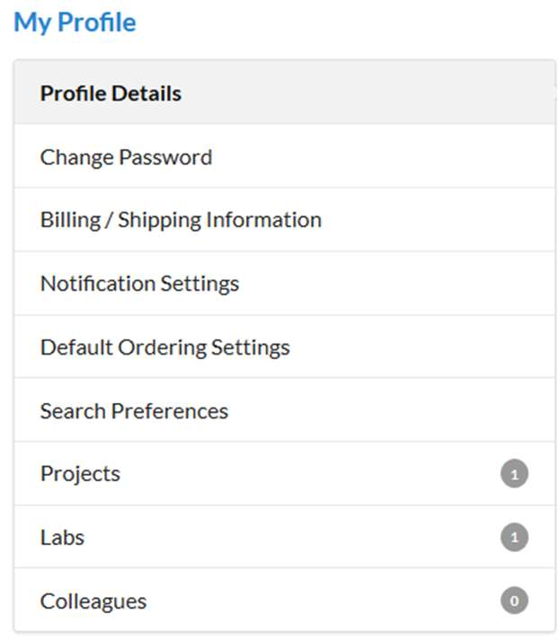

## Managing your group settings

It is advisable that you once in a while enter CrossLab and check that all your information is correct and that you have the correct group members associated to your lab. Press the “hamburger”-icon to the top left corner. Press My Group and select the group you wish to access the settings for (some PIs have more than one group, e.g. one GU and one SU group).  
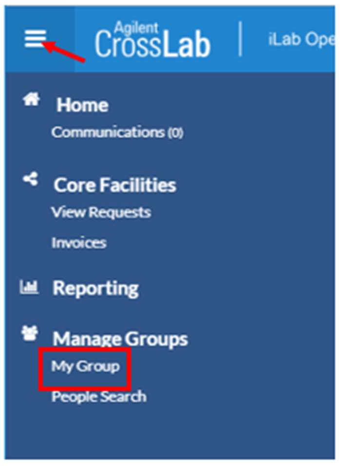

### Members

Under the Members tab (1) you can see the people, who are members of your group.  
You can either add a new user to your group or add a user who already has a CrossLab account (2).  
The status of a current member can be updated by clicking the edit button to the far right (3).  
For members who have left your group, please, set an end date to the membership (4).  
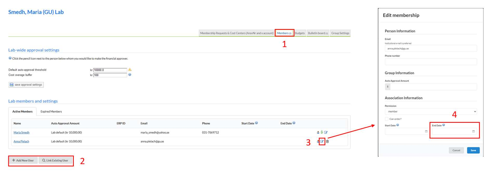
> **NOTE**: Do NOT remove any member from your group by clicking the trash button!  

### Entering/updating your billing information

For internal billing, a text file with the information about the charges is exported from CrossLab and imported into Agresso. The only billing information needed is your (or your economy administrator’s) x-account and AnsvarsNr.  

Go to the Membership Requests & Cost Centers (AnsvNr and x account) tab:

1. Press the link Manually add a new Cost Center (AnsvNr and x account)
2. Enter your Ansvars number and your x-account
3. Press Add

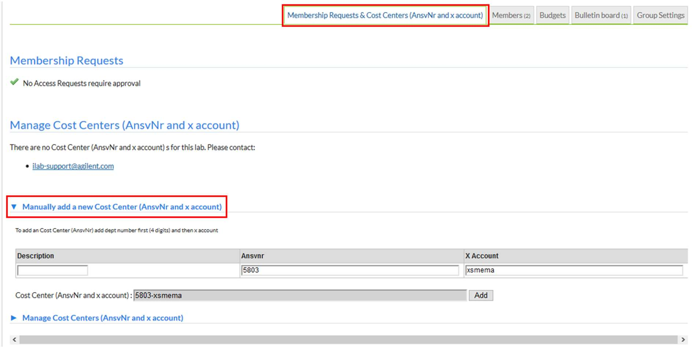

### Invoices and the billing procedure

We create so-called Billing events in CrossLab for each invoicing period. This billing information is then imported into the university accounting system Agresso.  
In the invoice sent to you there will be a link address to the CrossLab pre-invoice. This link has the format https://eu.ilabsolutions.com/invoices/XXXXX, where XXXXX is the current invoice number.  
Click the "hamburger-"icon at the top left corner in CrossLab and then Invoices:

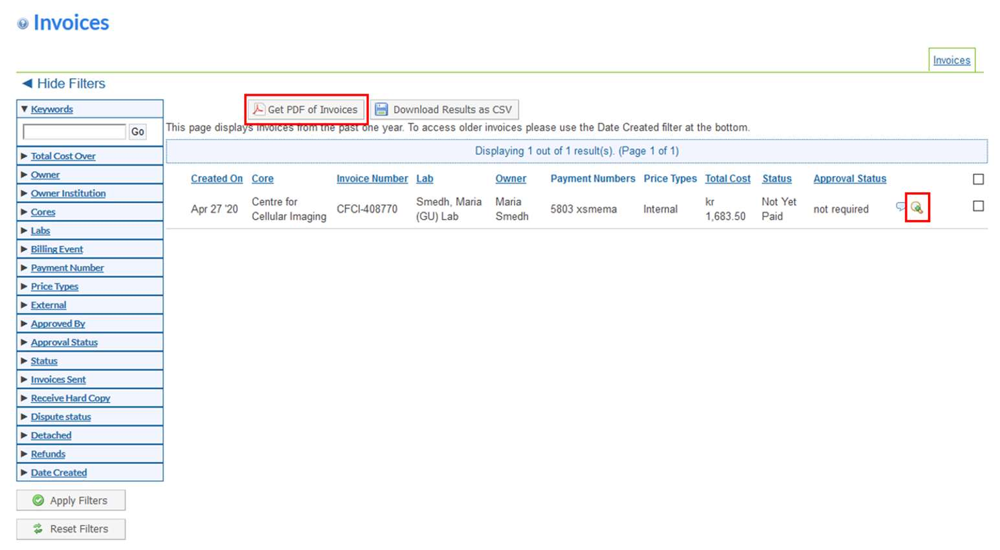

Here you can view an invoice by clicking on the magnifying glass icon 🔎 to the right and export the invoice to a PDF file using the button Get PDF of invoices. Please, contact Ai-Linh Nguyen (ai-linh.nguyen@gu.se) or Lisa Månsson (lisa.mansson@gu.se) if you have any questions about accounting.

## Optional: CCI registration

This part has to be done by all microscope users. Therefore, if you, as a PI, only have a CrossLab account for the invoicing for your students, postdocs etc, there is no need to go through this registration. If you, on the other hand, will get training for using any equipment, please, follow these steps for the CCI registration procedure!

1. Go to the Request services (1) tab to fill out the CCI registration form, which is found under Registration Form for New Users (2) and click request service (3).  
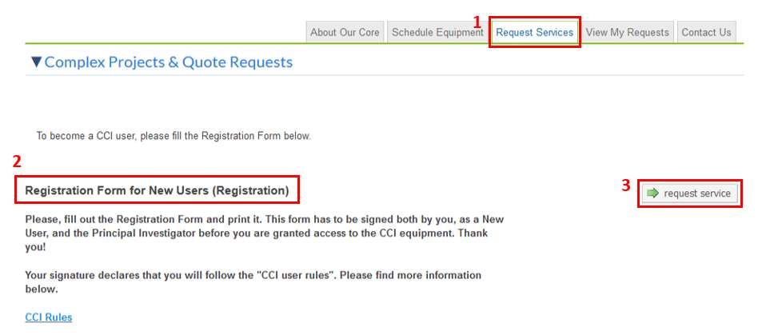
2. Fill out the form, print it (1), save it (2) and press submit request to core (3).  

3. Sign the printed form, and bring it to us before the start of the training (or any other service).

## More information and support

You reach the Support Portal by clicking the Help button, next to the Sign out button at the upper right corner of the page.

Here you can also browse the help site (1) to get more information on how to use CrossLab, e.g. for equipment bookings and service request instructions. In case of technical problems with the CrossLab software can get assistance from the CrossLab Support Team by submitting a Support Ticket (2) where you describe your problem.  
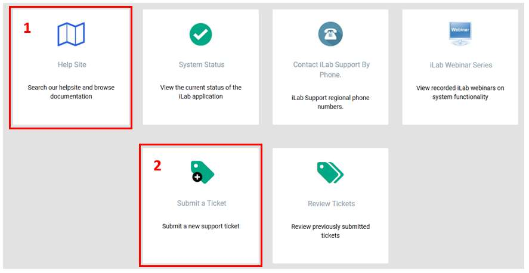

Sincerely,  
The CCI Team

---
Medicinaregatan 7A, PO Box 435,  
SE 405 30 Gothenburg, Sweden  
[www.cf.gu.se](www.cf.gu.se)  
THE SAHLGRENSKA ACADEMY  
CENTRE FOR CELLULAR IMAGING
