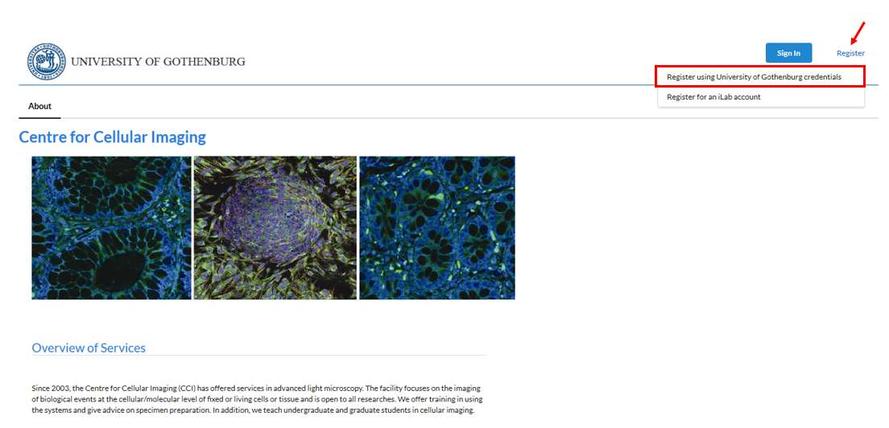
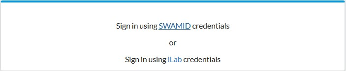
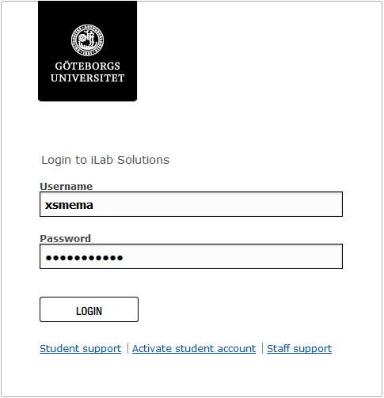
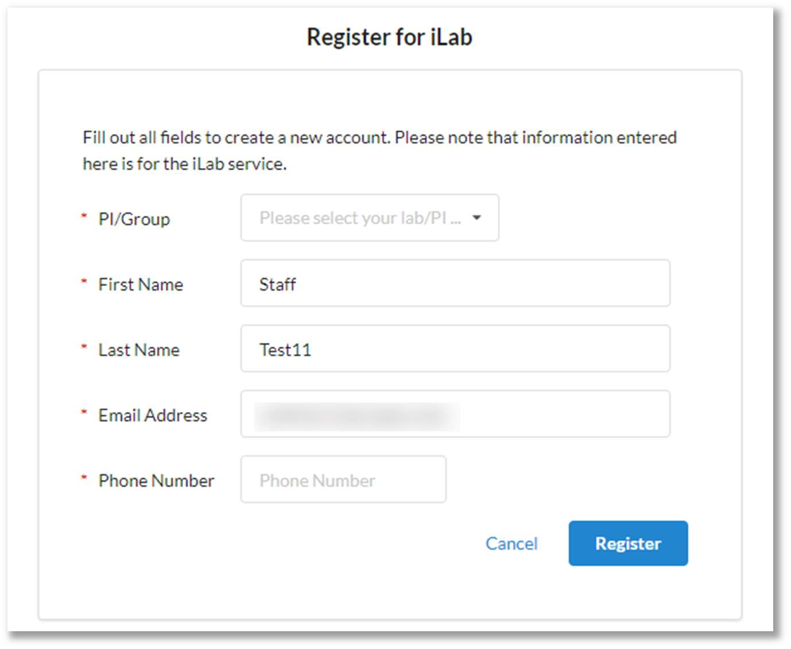
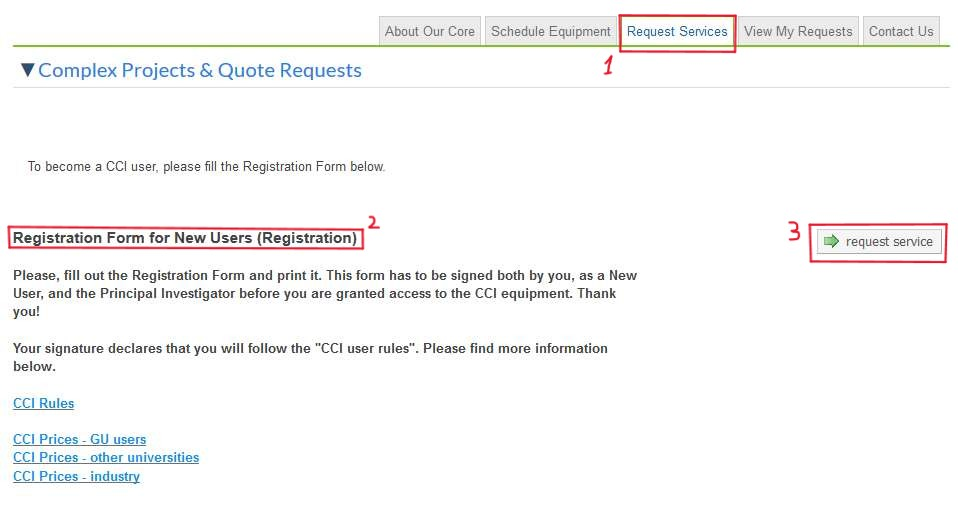
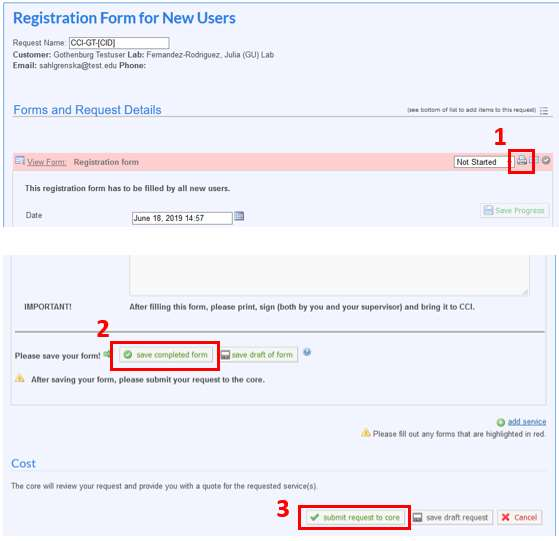
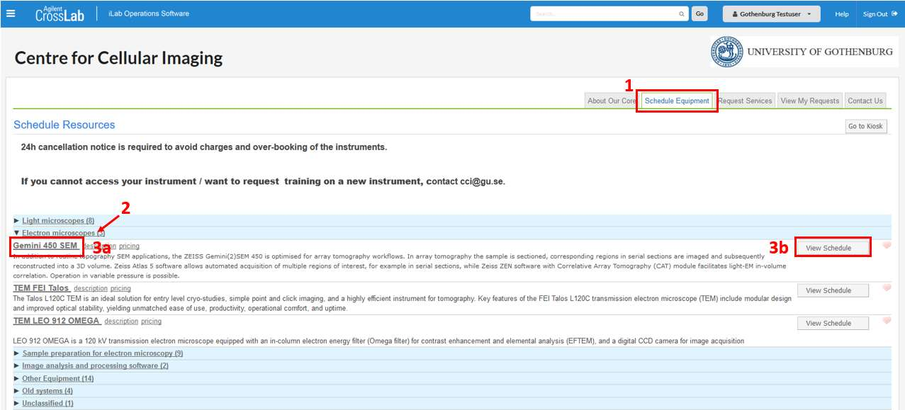
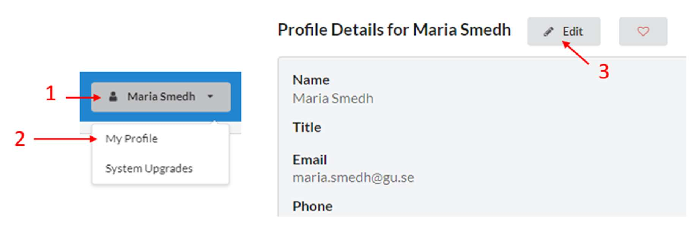

# CrossLab manual – GU user

The Centre for Cellular Imaging (CCI) is using a web-based tool, CrossLab (formerly iLab), to help manage the equipment resources at the CCI. CrossLab is used for registration, all resource booking at CCI, tracking of usage, service requests, user database, inventory management and reporting/billing.

## CONTENTS

- [Signing up for CrossLab/iLab](#signing-up-for-crosslabilab)
- [CCI registration form](#cci-registration-form)
- [Booking equipement](#booking-equipment)
- [How to change profile details](#how-to-change-profile-details)
- [More information and support](#more-information-and-support)

## Signing up for CrossLab/iLab

Please, follow the instructions below to sign up for a CrossLab account. With active credentials you can access the CCI core services through the on-line system.

1. Navigate to the [CCI core page](https://gothenburg.corefacilities.org/service_center/show_external/3429)

> **IMPORTANT**: Bookmark this page for future use.

2. Place your mouse pointer above the word Register at the top right corner and select 'Register using University of Gothenburg credentials'.

3. On the login page, select Sign in using SWAMID credentials  

4. At this point you will be prompted to select an Identity service. Search for University of Gothenburg in the dropdown list (the easiest way is to start typing the word Gothenburg).
5. Select log in and provide your SWAMID (GU x-account) username and password.  

6. Once you have been authenticated you will be directed to a registration page:

- First, select the appropriate Principal Investigator (PI)/Group from the dropdown list. IMPORTANT: If your research group is not found here, there are two options:
    - Your PI need to register his/her lab in CrossLab first.
    - If your PI has hospital grant and he/she has a SU Lab, you will not see this group. Then select Test (GU) Lab from the drop-down list.
- Your first name, last name, and email address will be pre-filled.
- Add your telephone number.
- Click Register.

7. The next page you see will be a Greeting Page.
8. An email has been sent to the PI you selected, informing them that your account requires approval. If the PI has a designated lab manager, they can approve your account as well.

> **IMPORTANT**: Your PI is reminded each business day, but you have the opportunity to send an additional reminder.

9. You will receive a Welcome email with a brief 'getting started' instructions. This can take up to 24 hours. In case you do not see this e-mail, please, check your SPAM/Junk folder.
10. Once your account has been approved you will receive an email notifying you.

## CCI registration form

1. Navigate to the [CCI core page](https://gothenburg.corefacilities.org/service_center/show_external/3429)
2. Click the Sign In button at the upper right corner of the page and select “Sign in using SWAMID credentials”, i.e. use your GU credentials.
3. Go to the Request services (1) tab to fill out the CCI registration form, which is found under Registration Form for New Users (2) and Click request service (3).  

4. Fill out the form, print it (1), save it (2) and press submit request to core (3).

5. Sign the printed form, get the signature from your PI, and bring it to us before the start of the training, EM sample preparation, or any other service.

## Booking equipment

After you have fulfilled a training, you will get access to book that particular equipment.

1. Go to the CCI core page and the Schedule equipment tab.
2. In the list of different types of equipment, press one of the categories, e.g. Electron microscopes, to see all the equipment under that category.

3. Select one of the equipment, either by clicking the name (3a) or the button View Schedule (3b).
4. Left-click in the calendar and drag your mouse cursor over the hours you want to book.
5. A booking event page pops up. Enter some text in the Event Notes box, if required. Click the button Save Reservation at the bottom left corner.
6. If you need to unbookDouble-click on your booking to open the booking event page. Click the button Delete Reservation at the bottom right corner.

> **IMPORTANT**: Unbooking is only possible up to 24 hours in advance. After that the 'Delete Reservation' button disappears.

## How to change profile details

To change your profile details:

1. Click your profile button at the upper right corner in CrossLab
2. Select “My Profile”
3. Click “Edit” and update the appropriate fields

## More information and support

You reach the Support Portal by clicking the Help button, next to the Sign out button at the upper right corner of the page.
 
Here you can also browse the help site (1) to get more information on how to use CrossLab, e.g. for equipment bookings and service request instructions. In case of technical problems with the CrossLab software can get assistance from the CrossLab Support Team by submitting a Support Ticket (2) where you describe your problem.  

Sincerely,  
the CCI Team  

---
Medicinaregatan 7A, PO Box 435,  
SE 405 30 Gothenburg, Sweden  
[www.cf.gu.se](www.cf.gu.se)  
THE SAHLGRENSKA ACADEMY  
CENTRE FOR CELLULAR IMAGING
