# Signing up for CrossLab – New PI

The Centre for Cellular Imaging (CCI) is using a web-based tool, CrossLab, to help manage the equipment resources at the CCI. CrossLab is used for registration, all resource booking at CCI, tracking of usage, service requests, user database, inventory management and reporting/billing.

## Contents

- [Signing up for CrossLab](#signing-up-for-crosslab)
- [Logging in to CrossLab](#logging-in-to-crosslab)
- [Managing your profile settings](#managing-your-profile-settings)
    - [Managing your group settings](#managing-your-group-settings)
    - [Entering/updating billing information](#enteringupdating-billing-information)
    - [Invoices and the billing procedure](#invoices-and-the-billing-procedure)
- [Optional: CCI registration](#optional-cci-registration)
- [More information and support](#more-information-and-support)

## Signing up for CrossLab

To use CrossLab, you need your own personal credentials; please follow the instructions below to sign up for a CrossLab account and create your Lab (research group) for billing. With active credentials you can access core services through this online system.

1. Go to the [CrossLab sign-up page](https://gothenburg.corefacilities.org/account/1212/signup?sc_id=3429)
2. Enter your email address and press Continue.

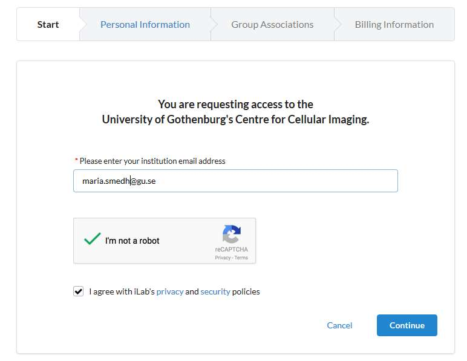

> **Important**: Use your work email address. DO NOT USE personal/private email accounts (gmail, Yahoo, etc.).

3. Fill in your personal information and press Continue.

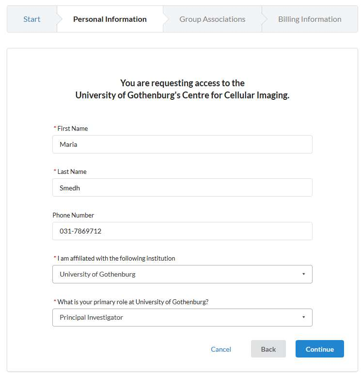

> **Important**: First search for your Institution, i.e. your university or other work place (e.g. University of Gothenburg, Chalmers University of Technology, Sahlgrenska University Hospital). If not in the list, write the English version of your Institution name!

4. Create your Lab by starting to write your name, then press Create New Group followed by Complete.

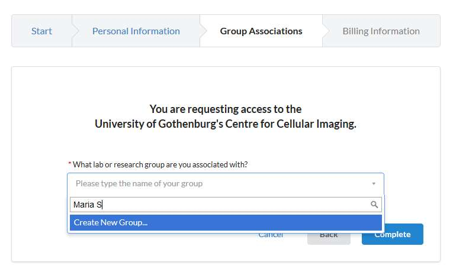

5. Enter the information about your research group and press Complete.

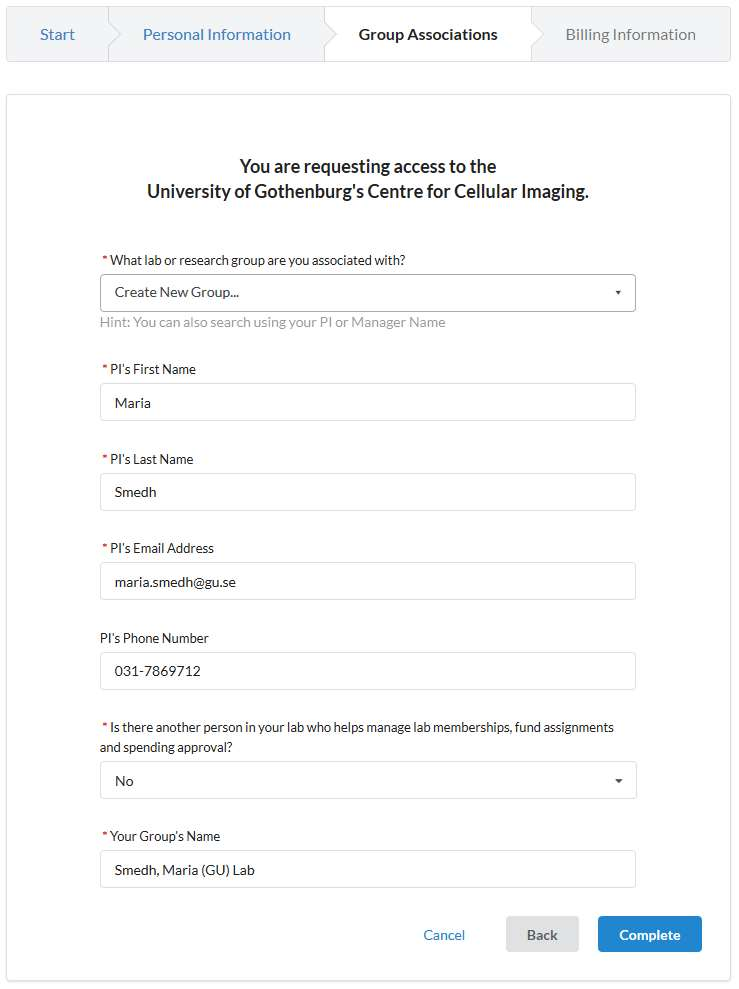

6. You will receive a “Welcome” e-mail (can take up to 24 hours) with login credentials and basic instructions.

## Logging in to CrossLab

- Navigate to the [CCI core page](https://gothenburg.corefacilities.org/service_center/show_external/3429)
- Click the *Sign in* button at the upper right corner of the page. Your web browser have to accept pop-up windows. Enter your username (i.e. your email) and password provided by CrossLab and press a *Sign in* button once more.

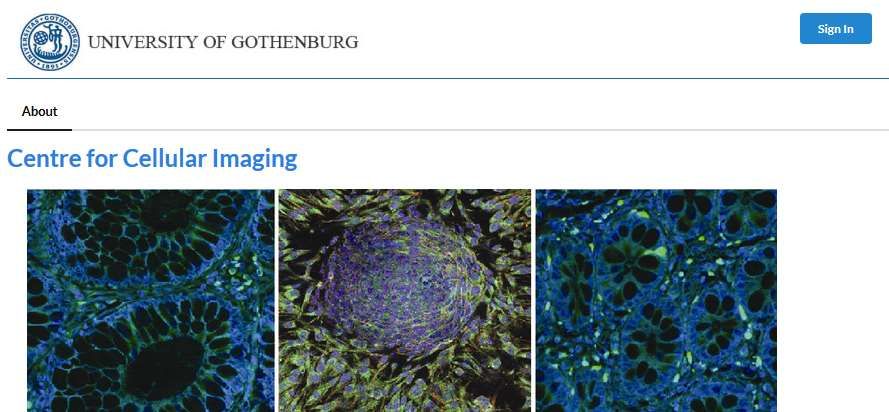

> *Note*: If you do not remember your password you can press the “Forgot your password?” link to reset the password.
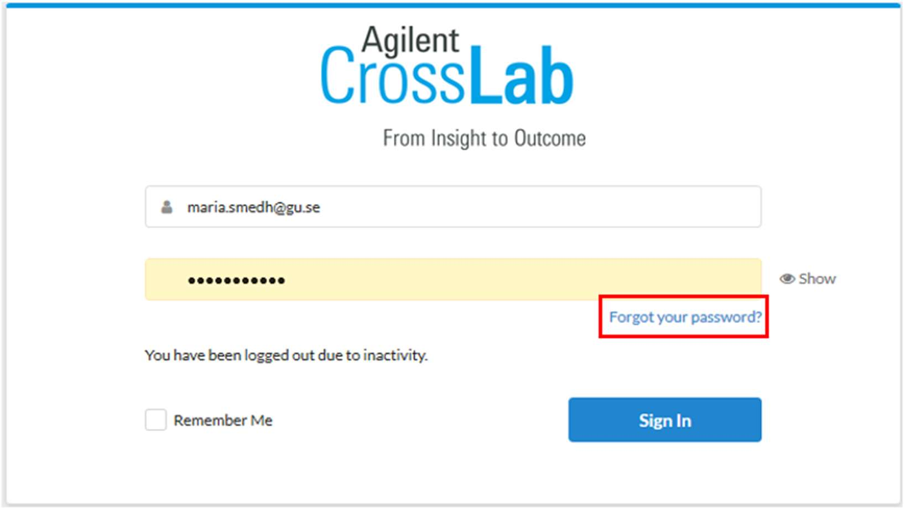

## Managing your profile settings

When you have logged in you can access your profile settings if you click your name at the upper right corner. Here you can change your name, password etc.

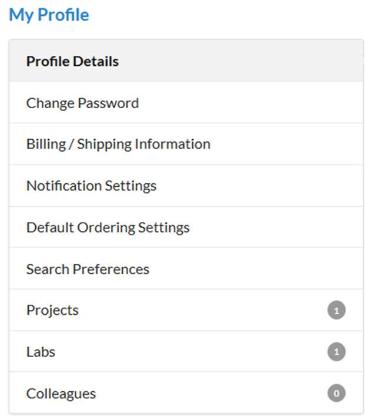

### Managing your group settings

It is advisable that you once in a while enter CrossLab and check that all your information is correct and that you have the correct group members associated to your lab. Press the “hamburger”-icon to the top left corner. Press “My Group” and select the group you wish to access the settings for (some PIs have more than one group, e.g. one GU and one SU group).

Under the Members tab (1) you can see the people, who are members of your group. You can either add a new user to your group or add a user who already has a CrossLab account (2). The status of a current member can be updated by clicking the edit button to the far right (3). For members who have left your group, please, set an end date to the membership (4).

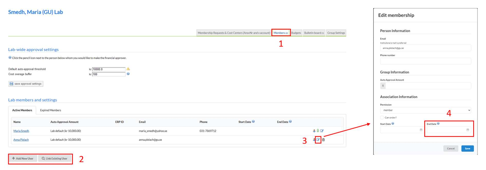

> **NOTE**: Do **NOT** remove any member from your group by clicking the trash button!

### Entering/updating billing information

1. Go to My Profile link on the upper right corner of the page

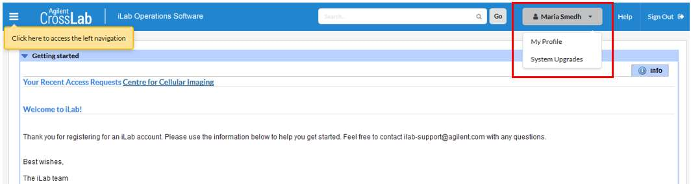

2. Go to the Billing/Shipping Information page

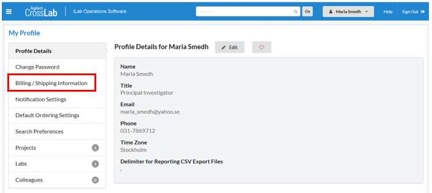

3. Click the Edit button and enter your billing information

    - Name
    - Institution (University, company etc.)
    - Department: This should be the billing reference number and/or reference person (e.g. Ansvarsnummer, PO number)
    - Your full billing address, including VAT number

> **IMPORTANT!** Remember to click Save!

### Invoices and the billing procedure

We create so-called Billing events in CrossLab for each invoicing period. This billing information is then imported into the university accounting system Agresso. In the invoice sent to you there will be a link address to your CrossLab invoice. This link has the format https://eu.ilabsolutions.com/invoices/XXXXX, where XXXXX is the current invoice number.

Click the “hamburger”-icon at the top left corner in CrossLab and then “Invoices”.

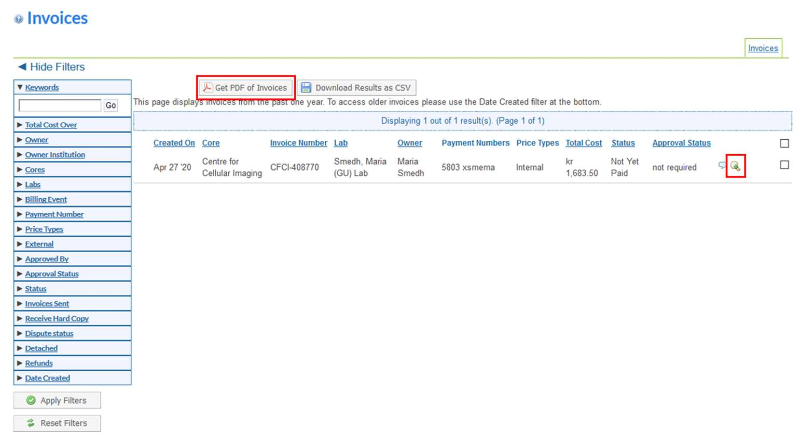

Here you can view an invoice by clicking on the magnifying glass icon to the right and export the invoice to a PDF file using the button “Get PDF of invoices”. Please, contact Ai-Linh Nguyen (ai-linh.nguyen@gu.se) or Lisa Månsson (lisa.mansson@gu.se) if you have any questions about accounting.

## Optional: CCI registration

This part has to be done by all users of the facility. Therefore, if you, as a PI, only have a CrossLab account for the invoicing for your students, postdocs etc, there is no need to go through this registration. If you, on the other hand, will be trained for using any equipment, please, follow these steps for the CCI registration procedure!

1. Go to the Request services (1) tab to fill out the CCI registration form, which is found under Registration Form for New Users (2) and click request service (3)

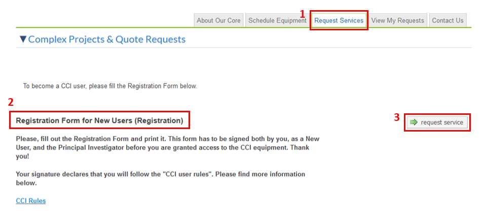

2. Fill out the form, print it (1), save it (2) and press submit request to core (3)

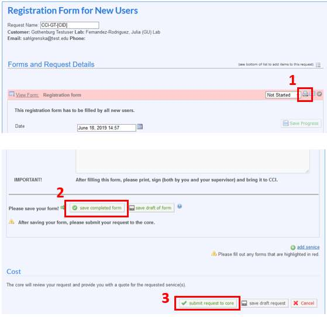

3. Sign the printed form, and bring it to us before the start of the training (or any other service).

## More information and support

You reach the Support Portal by clicking the Help button, next to the Sign out button at the upper right corner of the page.

Here you can also browse the help site (1) to get more information on how to use CrossLab, e.g. for equipment bookings and service request instructions. In case of technical problems with the CrossLab software can get assistance from the CrossLab Support Team by submitting a Support Ticket (2) where you describe your problem.

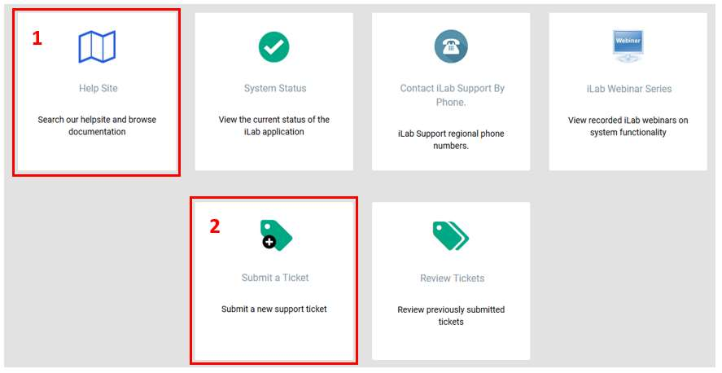

Sincerely,  
The CCI Team

---
Medicinaregatan 7A, PO Box 435,  
SE 405 30 Gothenburg, Sweden  
[www.cf.gu.se](www.cf.gu.se)  
THE SAHLGRENSKA ACADEMY  
CENTRE FOR CELLULAR IMAGING
