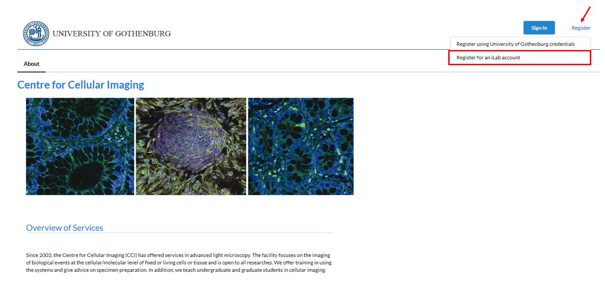
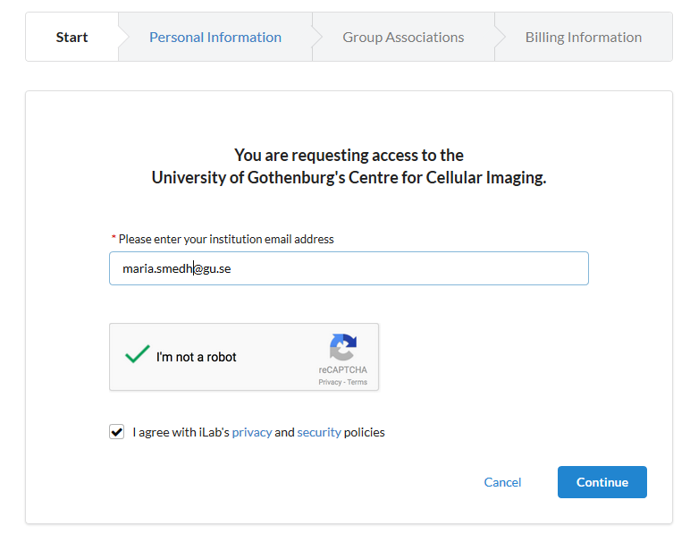
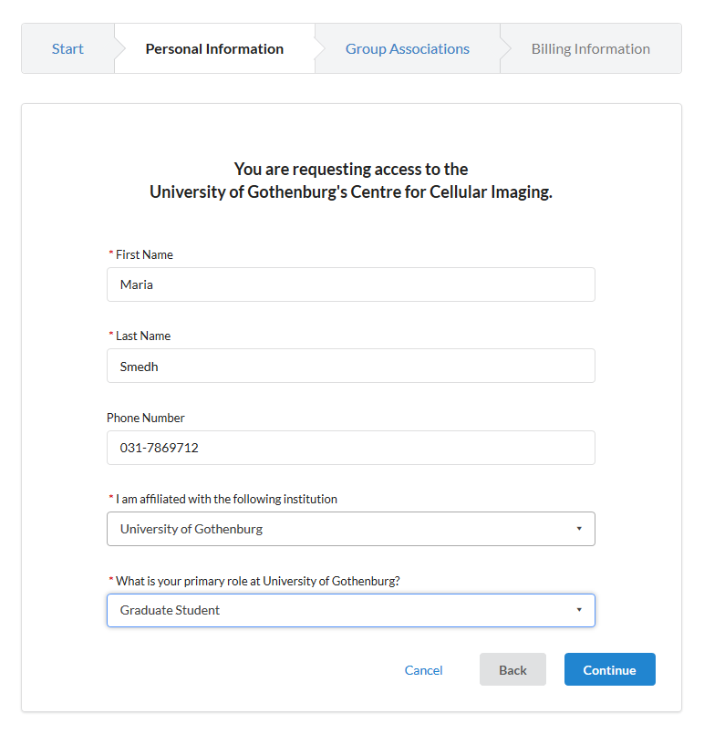
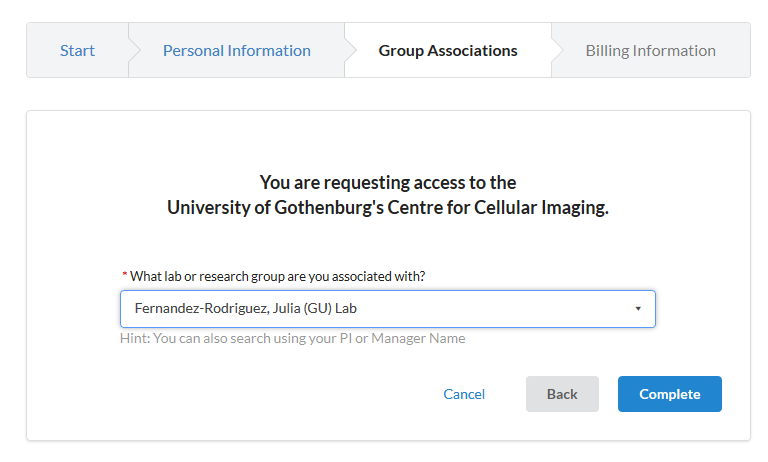
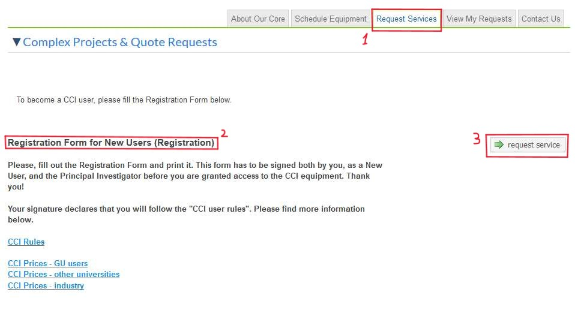
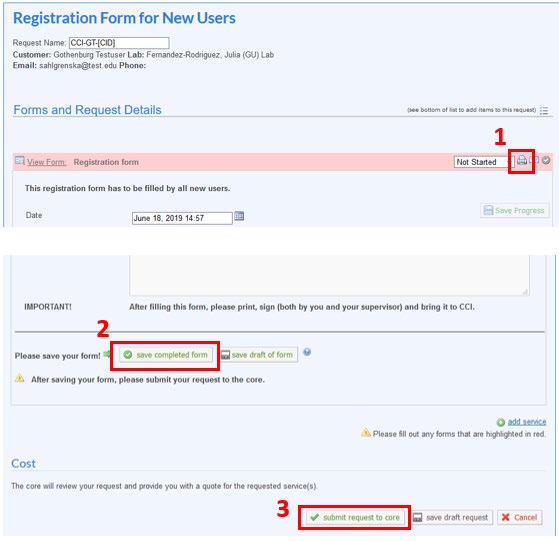
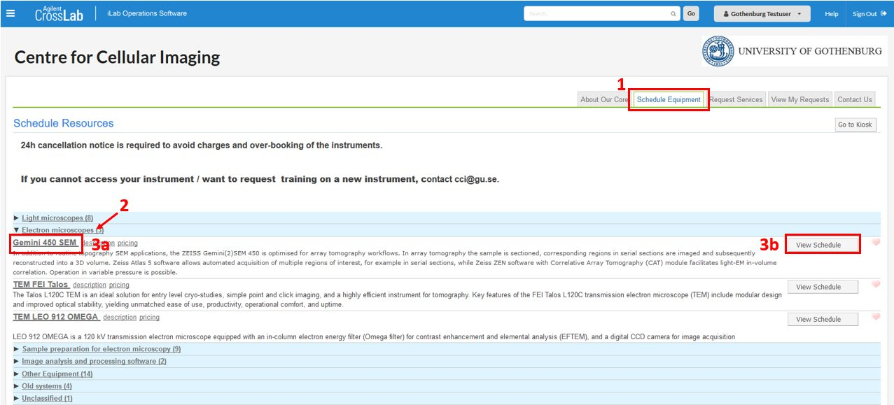
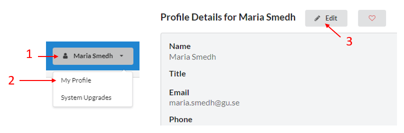
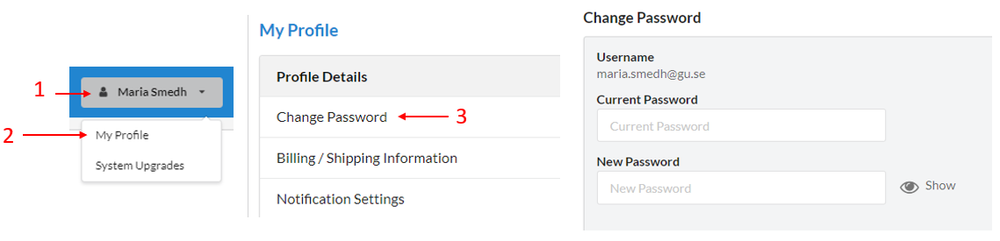
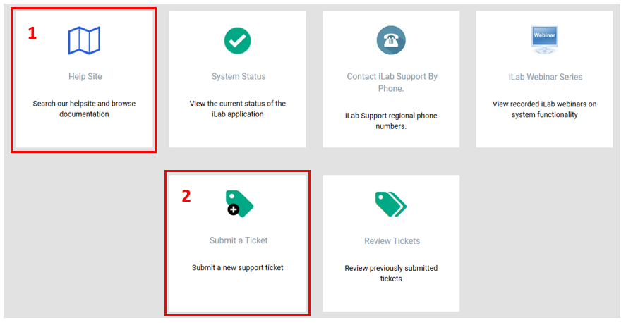

# CrossLab manual – External user

The Centre for Cellular Imaging (CCI) is using a web-based tool, CrossLab (formerly iLab), to help manage the equipment resources at the CCI. CrossLab is used for registration, all resource booking at CCI, tracking of usage, service requests, user database, inventory management and reporting/billing.

## Contents

- [Signing up for CrossLab/iLab](#signing-up-for-crosslabilab)
- [CCI registration form](#cci-registration-form)
- [Booking equipement](#booking-equipment)
- [How to change profile details](#how-to-change-profile-details-e-mail-phone-number-etc)
- [How to change password](#how-to-change-password)
- [More information and support](#more-information-and-support)

## Signing up for CrossLab/iLab

Please, follow the instructions below to sign up for a CrossLab account. With active credentials you can access the CCI core services through the on-line system.

1. Navigate to the [CCI core page](https://gothenburg.corefacilities.org/service_center/show_external/3429).

> **IMPORTANT**: Bookmark this page for future use.

2. Place your mouse pointer above the link Register at the top right corner and select *'Register for an iLab account'*

3. Enter your email address, click I’m not a robot and that you agree with the iLab policies. Then press *Continue*.

> **IMPORTANT**: Use your work email address. **DO NOT USE** a personal/private email account (gmail, Yahoo, etc..)

4. Fill in your personal information and press *Continue*.

5. Search for the research group/lab of your PI and press *Complete*

6. You will receive a “Welcome” email from CrossLab with login credentials and basic instructions. This can take up to 24 hours. In case you do not see this e-mail, please, check your SPAM/Junk folder.

## CCI registration form

1. Navigate to the [CCI core page](https://gothenburg.corefacilities.org/service_center/show_external/3429).
2. Click the *Sign In* button at the upper right corner of the page and enter your username (i.e. your email) and password provided by CrossLab and log in.
3. Go to the Request services (1) tab to fill out the CCI registration form, which is found under Registration Form for New Users (2) and Click request service (3).

4. Fill out the form, print it (1), save it (2) and press submit request to core (3).

5. Sign the printed form, get the signature from your PI, and bring it to us before the start of the training, EM sample preparation, or any other service.

## Booking equipment

After you have fulfilled a training, you will get access to book that particular equipment.

1. Go to the CCI core page and the Schedule equipment tab. 
2. In the list of different types of equipment, press one of the categories, e.g. *Electron microscopes*, to see all the equipment under that category.
3. Select one of the equipment, either by clicking the name (3a) or the button View 
Schedule (3b).

5. A booking event page pops up. Enter some text in the Event Notes box, if required. Click the button Save Reservation at the bottom left corner.
6. If you need to unbookDouble-click on your booking to open the booking event page. Click the button Delete Reservation at the bottom right corner.

> **IMPORTANT**: Unbooking is only possible up to 24 hours in advance. After that the *Delete Reservation button* disappears.

## How to change profile details (e-mail, phone number etc)

To change your profile details:

1. Click your profile button at the upper right corner in CrossLab
2. Select “My Profile”
3. Click “Edit” and update the appropriate fields

## How to change password

To change your password:

1. Click your profile button at the upper right corner in CrossLab
2. Select “My Profile”
3. Select “Change Password”
4. Enter the current password and type a new password

## More information and support

You reach the Support Portal by clicking the Help button, next to the Sign out button at the upper right corner of the page.

Here you can also browse the help site (1) to get more information on how to use CrossLab, e.g. for equipment bookings and service request instructions.
In case of technical problems with the CrossLab software can get assistance from the CrossLab Support Team by submitting a Support Ticket (2) where you describe your problem.

Sincerely,  
The CCI Team

---
Medicinaregatan 7A, PO Box 435,  
SE 405 30 Gothenburg, Sweden  
[www.cf.gu.se](www.cf.gu.se)  
THE SAHLGRENSKA ACADEMY  
CENTRE FOR CELLULAR IMAGING
