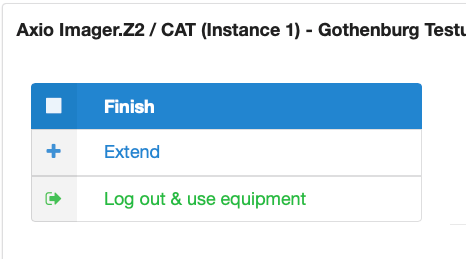

# Instructions for *Kiosk*: Equipment logging system

The *Kiosk* is a web-browser tool that allows users of the CCI to track their equipment usage and to activate features of the microscope and image analysis computers that are otherwise not available. In a general way, the workflow we describe here is done during the equipment session and, therefore, is accomplished after the user has placed a reservation for the desired equipment via the CrossLab page.

## Contents

- [Start your session](#start-your-session)
- [Finish your session](#finish-your-session)
- [Extend your session](#extend-your-session)
- [Forgot to finish your session](#forgot-to-finish-your-session)

## Start your session

1) Turn on the computer associated with the equipment you have booked:
    - For microscopes: Turn on the microscope and microscope computer.
    - For image analysis computers turn on the PC.
2) A web browser with the CCI booking site will automatically open on the PC. Alternatively, the site is available as a shortcut on the PC’s desktop.
3) Sign in to the booking site using your CrossLab credentials.

4) There are two ways to reach the Kiosk:
    - Select the Schedule Equipment tab “Go to Kiosk”
    - Click on the top left corner of the CrossLab site , and then select “My Reservations”. Under Today’s Reservations you will find the “Go to Kiosk” option.

  

5) Your Kiosk Sessions will be displayed. Click “Start” button to initiate your session.

6) You now have an *active* session.

7) Minimize the web browser. The microscope or image analysis software is ready to use!

> **Remember:** Do **NOT** close the web browser.

## Finish your session

1) Save all your data and close the microscope or image analysis software.
2) Go to the web browser where the *Kiosk* is active.
3) Click on the “Finish” button.

4) Confirm your action. This cannot be undone!

5) Please, check if any user will use the equipment after you. Therefore, go back to the booking calendar from the top right corner of the *Kiosk*, via “Back to Core”.

6) Sign out of the CrossLab website.
7) If no user will work after you, then turn off the microscope or image analysis computer.

## Extend your session

You are allowed to extend your session if no other user has booked the microscope or image analysis computer. This can be done via the “Extend” button, which becomes available after your session is active for 30 minutes. The “Extend” button appears:

- directly under the “Finish” button (if you are on the detailed view)

- under the option arrow next to the “Finish” button (if you are back in the main “My Kiosk Sessions”)

The Kiosk will show allowed extension periods only, which differ depending on when the next user has booked the system. Select how long you wish to extend the session.

## Forgot to finish your session

It is critical that you remember to finish your session. If you forget to finish your session, then the system will assume that you have decided to extend your microscopy time. Therefore, your session will be extended until the session of the next user.

If you forget to finish your session and notice after you have left the facility, you have two alternatives:

- You log into the booking site of the CCI and stop your session via the *Kiosk*
- You immediately send an email to the CCI staff (cci@gu.se) to help you out.

Sincerely,  
The CCI Team

---
Medicinaregatan 7A, PO Box 435,  
SE 405 30 Gothenburg, Sweden  
[www.cf.gu.se](www.cf.gu.se)  
THE SAHLGRENSKA ACADEMY  
CENTRE FOR CELLULAR IMAGING
