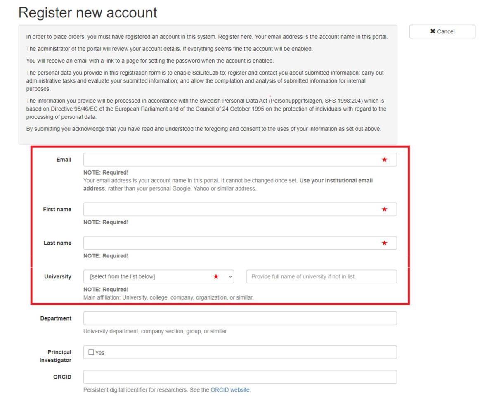
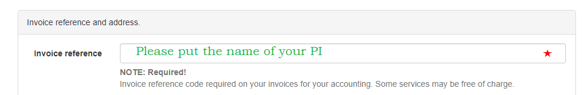
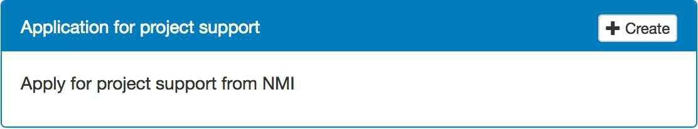
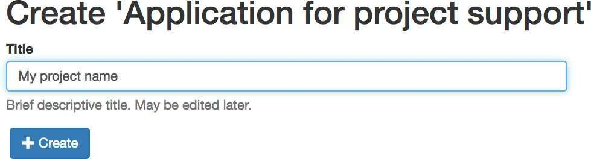
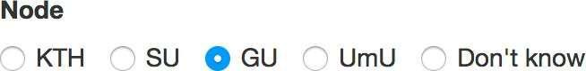

# NMI PORTAL

Final registration as a CCI User. You may know that in 2016 the CCI became "National Node in Advanced Microscopy" by the VR (Swedish Research Council). This truly remarkable achievement provides powerful proof of the ideals that drive the CCI and that we really do make a difference.

Furthermore, it allows us to receive financial support for the running costs of the facility. For that reason we ask for your collaboration, understanding and support in the following two ways:

1) All Users that work with our microscopes are required to acknowledge the National Microscopy Infrastructure in their publications as well. We suggest this model sentence for the publications:

> We acknowledge the Centre for Cellular Imaging at the University of Gothenburg and the National Microscopy Infrastructure, NMI (VR-RFI 2023-00163) for providing assistance in microscopy.

2) We are also obligated to register the CCI Users into the New National Microscopy Infrastructure "Web Portal” data base. We therefore need to enter all active projects in the NMI project application portal. You will need to write a short description of the work you want to do at the CCI. This is important both to us and to you as a CCI user, since this information will be used in our annual reports to VR. If we have many good projects to report we will have a better chance to get more funding in the future, which will benefit you since it will help us keep the microscopes up to date while still keeping the fees low. In addition, it is a merit to you if your project is considered to have national status! Please follow the instructions below to register your project.

## Registration in the NMI portal

1. Go to [sciliflab](https://nmi.scilifelab.se/) and press the green Register account button.

Frequently asked questions about Account Registration:

- All fields with a red asterisk (*) are required to be filled in as shown on the next page highlighted within red rectangle.

- For the Invoice reference field, you can add your PI’s name. Please note that invoicing at the CCI is not handled via the NMI portal.

Your e-mail address will be your login identity in this portal. Shortly after the registration (usually within a day) you will get an e-mail prompting you to set your password (if you already have an iLab password, we suggest that you use the same to make things easier). If you don’t get this welcome e-mail, please check your spam/junk mail box or contact CCI staff!

2. After logging in, click the Create button for the project support application

3. In the next step, you enter the project title

Then click Create. The application form opens. Here the three fields marked with a red star are mandatory to fill in, i.e. Scientific background, Project Description and Publication Agreement - Signature. Please, read the instructions below each field carefully.

> IMPORTANT: Make sure to click the check box for GU under the last field Node so that your project is assigned to us.

4. Then click the button Save and submit

Thanks,  
the CCI Team  

---
Medicinaregatan 7A, PO Box 435,  
SE 405 30 Gothenburg, Sweden  
[www.cf.gu.se](www.cf.gu.se)  
THE SAHLGRENSKA ACADEMY  
CENTRE FOR CELLULAR IMAGING
