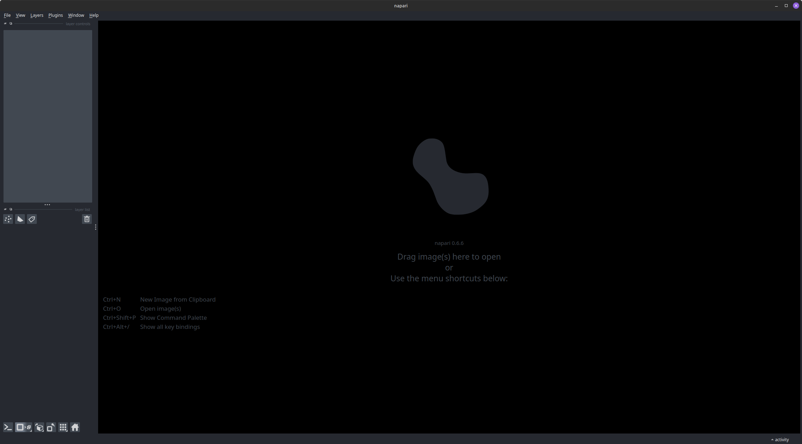
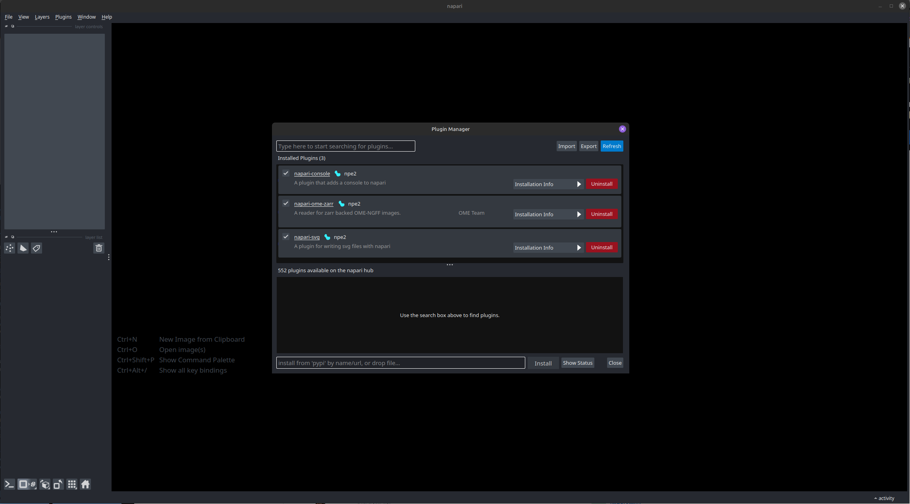
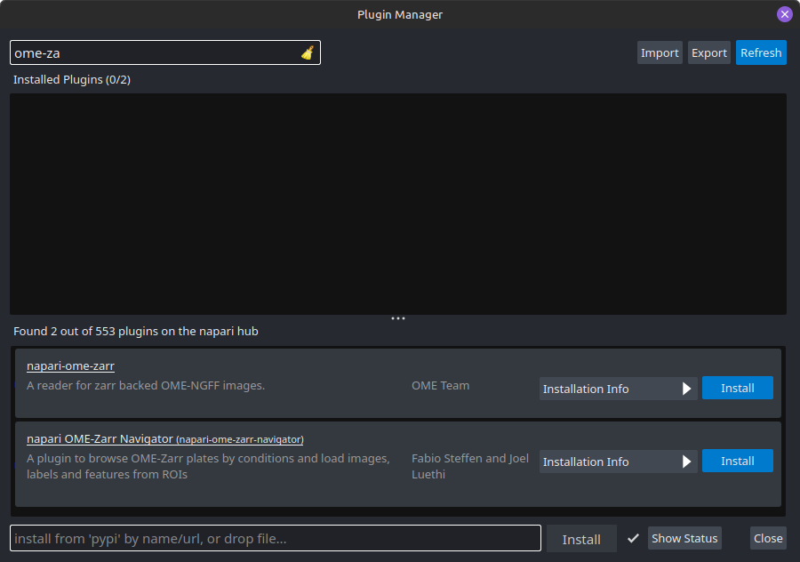
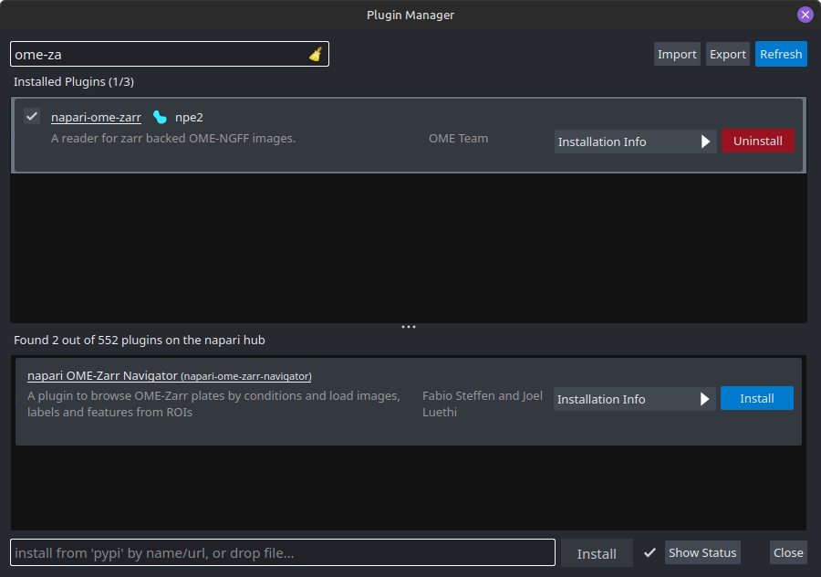

# Installing Napari and plugins

The simplest way to get Napari on your computer is to install it as a bundled app. After it is installed you can easily extend its functionality by installing plugins

1. Go to [this page](https://napari.org/stable/tutorials/fundamentals/installation_bundle_conda.html) and follow the instructions to download and install Napari for your computers platform.

2. Verify that it is working by launching Napari, either from your UI or from a terminal. You should have a viewer window showing something like this:

### Installing a plugin

Plugins are a great way to extend the functionality of Napari and they are easy to install. 

1. Locate the "plugins" menu in the main menu bar. Select it and then select "Install/Uninstall plugins..." This should bring up "Plugin Manager" window looking something like this:

2. Locate the plugin you want to install by typing the name in the search bar in the top left corner:

3. When you have located the correct plugin, click the "Install" button. The installation procedure will start and when it is done it will show up under "Installed plugins":

4. Close the "Plugin manager" and start using your plugin. Restart Napari if neccessary.

